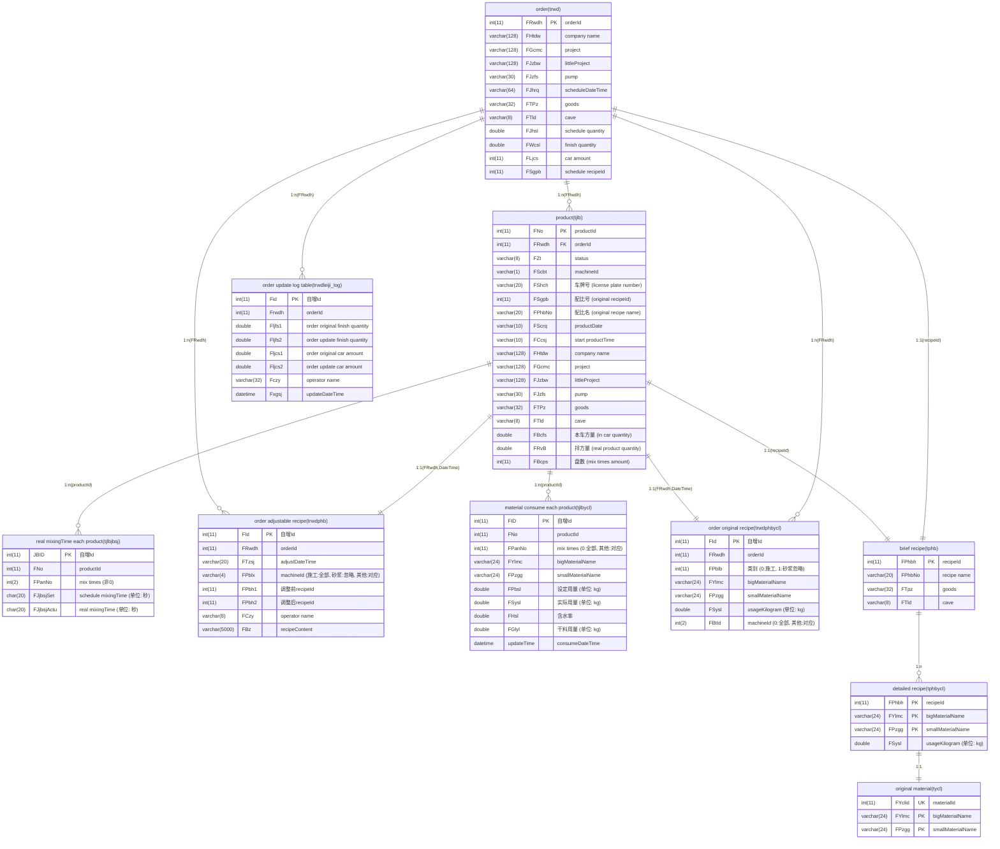
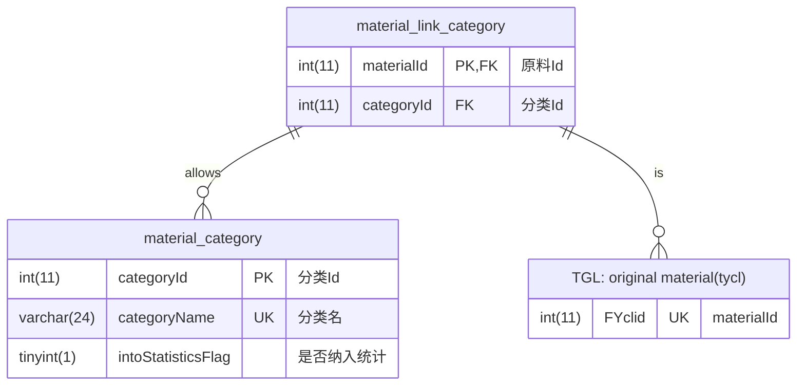

# SCG_TGL_assistant

Implement features that are not yet implemented by TGL.

## TGL TABLE

We mainly obtain data for the TGL software from the following table:

### order list table (called: trwd)
  
| columnName | description                                                      | used |
| ---------- | ---------------------------------------------------------------- | ---- |
| FRwdh      | orderId                                                          | Y    |
| FHtbh      | contractId                                                       |      |
| FRwxz      |                                                                  |      |
| FRwly      | from which software                                              |      |
| FZt        | status                                                           | Y    |
| FHtdw      | company name                                                     | Y    |
| FGcmc      | project name                                                     | Y    |
| FGcjb      |                                                                  |      |
| FGclb      |                                                                  |      |
| FJzbw      | littleProject name                                               | Y    |
| FJzfs      | pump                                                             | Y    |
| FBclb      |                                                                  |      |
| FGcdz      | location                                                         |      |
| FGls       |                                                                  |      |
| FJhrq      | scheduleDateTime                                                 | Y    |
| FTPz       | goods                                                            | Y    |
| FTld       | cave                                                             | Y    |
| FSNbh      |                                                                  |      |
| FSzgg      |                                                                  |      |
| FTbj       |                                                                  |      |
| FJhsl      | schedule quantity                                                | Y    |
| FScbt      | schedule machineId (和product中对应的 machineId 并不一定对应)    |      |
| FWcsl      | finish quantity                                                  | Y    |
| FLjcs      | car amount                                                       | Y    |
| FXdrw      |                                                                  |      |
| FCzy       | operator name                                                    |      |
| FDlrq      |                                                                  |      |
| FSgpb      | schedule recipeId                                                | Y    |
| FSjpb      |                                                                  |      |
| FJbsj      | schedule mixingTime                                              |      |
| FPhbNo     | schedule recipe name                                             |      |
| FBSfs      |                                                                  |      |
| Fwyzfs     | foreign aid from others quantity                                 | Y    |
| Fwyzcs     | foreign aid from others car amount                               | Y    |
| FVersion   | update this row DateTime(UTC) (TIMESTAMP格式, 存储的是UTC时间)   |      |
| updateTime | update this row DateTime(UTC+8) (DATETIME格式, 存储的是本地时间) |      |

### product list table (called: tjlb)
  
| columnName | description                                                                                                  | used |
| ---------- | ------------------------------------------------------------------------------------------------------------ | ---- |
| FNo        | productId                                                                                                    | Y    |
| Fguid      |                                                                                                              |      |
| FZt        | status                                                                                                       | Y    |
| FScrq      | productDate                                                                                                  | Y    |
| FScbt      | machineId                                                                                                    | Y    |
| FDcsj      | 到场时间                                                                                                     |      |
| FCcsj      | start productTime                                                                                            | Y    |
| FRwdh      | orderId                                                                                                      | Y    |
| FHtbh      | contractId                                                                                                   |      |
| FKhbh      |                                                                                                              |      |
| FHtdw      | company name                                                                                                 | Y    |
| FGcmc      | project name                                                                                                 | Y    |
| FGcdz      | location                                                                                                     |      |
| FJzbw      | littleProject name                                                                                           | Y    |
| FJzfs      | pump                                                                                                         | Y    |
| FGls       |                                                                                                              |      |
| FTPz       | goods                                                                                                        | Y    |
| FTld       | cave                                                                                                         | Y    |
| FSgpb      | original recipeId                                                                                            | Y    |
| FSjpb      |                                                                                                              |      |
| FShch      | license plate number                                                                                         | Y    |
| FSjxm      | driver name                                                                                                  |      |
| FBcps      | mix times amount                                                                                             | Y    |
| FBcfs      | 本车方量 (in car quantity)                                                                                   | Y    |
| FZzl       | weight                                                                                                       |      |
| FBsfs      | 泵送方量                                                                                                     |      |
| FLjfs      | in car quantity cumulative total (根据order表中的 实时 finish quantity 为基础, 加上本车方量 in car quantity) |      |
| FLjcs      | car cumulative total (根据order表中的 实时 car amount 为基础, 加上 1)                                        |      |
| FCcqf      | 出场签发 (issuer name)                                                                                       |      |
| FYhqs      |                                                                                                              |      |
| FCzy       | operator name                                                                                                |      |
| FBz        |                                                                                                              |      |
| FRz        |                                                                                                              |      |
| FPhbNo     | original recipe name                                                                                         | Y    |
| FBcfsC     | ? 不一定 FBcfsC + FBcfsM = FBcfs                                                                             |      |
| FBcfsM     | ?                                                                                                            |      |
| FPcbID     |                                                                                                              |      |
| FPhbSJ     |                                                                                                              |      |
| FRvA       | 余方量 (别的工地转过来的, 车里剩的)(surplus quantity)                                                        | Y    |
| FRvB       | 拌方量 (real product quantity)                                                                               | Y    |
| FRvC       | 票方量                                                                                                       |      |
| FQvA       | 退方量 (全都是0, 未使用)                                                                                     |      |
| FCcsjEx    | end productTime                                                                                              |      |
| Fdywc      | 小票是否打印完成 (has printed)                                                                               |      |
| Fqrscwc    | 确认生产完成 (has produced)                                                                                  |      |
| Fdysj      | 第一次小票打印的时间 (printDateTime)                                                                         |      |
| FVersion   | update this row DateTime(UTC)                                                                                |      |
| updateTime | update this row DateTime(UTC+8)                                                                              |      |

### original material table (called: tycl)
  
| columnName | description              | used |
| ---------- | ------------------------ | ---- |
| FYclid     | materialId               | Y    |
| FYlmc      | 原料 (bigMaterialName)   | Y    |
| FPzgg      | 品种 (smallMaterialName) | Y    |
| FLb        |                          |      |

### brief system original recipe table (called: tphb)
  
| columnName | description                   | used |
| ---------- | ----------------------------- | ---- |
| FPhbh      | recipeId                      | Y    |
| FZt        | status                        |      |
| FTpz       | goods                         | Y    |
| FYt        | 用途                          |      |
| FTld       | cave                          | Y    |
| FSnpz      | 水泥品种                      |      |
| FSzgg      | 石子规格                      |      |
| FTbj       | 砼标记                        |      |
| FTlq       | 龄期                          |      |
| FBz        |                               |      |
| FSy        |                               |      |
| FSh        |                               |      |
| FJsfz      |                               |      |
| FCzy       | operator name                 |      |
| FDlrq      |                               |      |
| FJbsj      | schedule mixingTime           |      |
| FClsjNo    |                               |      |
| FPhbNo     | recipe name                   | Y    |
| FVersion   | update this row DateTime(UTC) |      |

### detailed system original recipe table (called: tphbycl)

| columnName | description                      | used |
| ---------- | -------------------------------- | ---- |
| FPhbh      | recipeId                         | Y    |
| FYlmc      | 原料 (bigMaterialName)           | Y    |
| FPzgg      | 品种 (smallMaterialName)         | Y    |
| FSysl      | 用量 (usageKilogram)(单位是: kg) | Y    |
| FVersion   | update this row DateTime(UTC)    |      |

### order original recipe table (called: trwdphbycl)
  
| columnName | description                                       | used |
| ---------- | ------------------------------------------------- | ---- |
| FId        | 自增Id                                            |      |
| FRwdh      | orderId                                           | Y    |
| FPblb      | 类别 (0是施工recipe, 1是砂浆recipe, 忽略砂浆)     | Y    |
| FYlmc      | 原料 (bigMaterialName)                            | Y    |
| FPzgg      | 品种 (smallMaterialName)                          | Y    |
| FSysl      | 用量 (usageKilogram)(单位是: kg)                  | Y    |
| FPlcw      |                                                   |      |
| FBtId      | machineId (0 代表全部, 其他数代表对应的machineId) | Y    |
| FCkno      |                                                   |      |
| FHsl       | 含水率 (全都是0)                                  |      |
| updateTime | update this row DateTime(UTC+8)                   |      |

### order adjustable recipe table (called: trwdphb)
  
| columnName | description                                                                            | used |
| ---------- | -------------------------------------------------------------------------------------- | ---- |
| FId        | 自增Id                                                                                 |      |
| FRwdh      | orderId                                                                                | Y    |
| FTzsj      | adjustDateTime                                                                         | Y    |
| FPblx      | machineId (施工 代表全部, 砂浆 代表忽略这个adjust, 其他数代表对应的machineId)          | Y    |
| FPbh1      | 调整前recipeId                                                                         |      |
| FPbh2      | 调整后recipeId                                                                         |      |
| FXpbh      | (未使用)                                                                               |      |
| FLjcs      | (未使用)                                                                               |      |
| FCzy       | operator name                                                                          |      |
| FSyy       | 试验员 (未使用)                                                                        |      |
| FBz        | recipeContent (形式是: 若干个 {bigMaterialName(smallMaterialName)=usageKilogram} 相连) | Y    |
| FNo        | (未使用)                                                                               |      |
| updateTime | update this row DateTime(UTC+8)                                                        |      |

### original material consume each product table (called: tjlbycl)

| columnName | description                                                                                                                               | used |
| ---------- | ----------------------------------------------------------------------------------------------------------------------------------------- | ---- |
| FID        | 自增Id                                                                                                                                    |      |
| FNo        | productId                                                                                                                                 | Y    |
| FPanNo     | mix times (0 代表全部, 其他数代表对应的mix times)                                                                                         | Y    |
| FBh        | 仓库编号                                                                                                                                  |      |
| FYlmc      | 原料 (bigMaterialName)                                                                                                                    | Y    |
| FPzgg      | 品种 (smallMaterialName)                                                                                                                  | Y    |
| FPbsl      | 设定用量 (使用的是经过含水率修正的配比)(只有砂、石设定用量需要含水率修正)(计算公式: [(1+含水率%)*理论值]四舍五入取整=设定值 )(单位是: kg) | Y    |
| FSysl      | 实际用量 (按照设定用量投料, 但是投料不能那么精确, 这是称出的重量)(单位是: kg)                                                             | Y    |
| FHsl       | 含水率 (只有砂、石考虑含水率, 其他料的含水率默认是0)                                                                                      | Y    |
| FGlyl      | 干料用量 (只有砂、石扣除其中含的水后的实际用量, 其他原料的干料用量等同实际用量, 自来水、外加剂等液体也是)                                 | Y    |
| FPlcw      | 配料仓位                                                                                                                                  |      |
| updateTime | update this row DateTime(UTC+8)                                                                                                           | Y    |

### real mixingTime each product table (called: tjlbjbsj)

| columnName | description                                                      | used |
| ---------- | ---------------------------------------------------------------- | ---- |
| JBID       | 自增Id                                                           |      |
| FNo        | productId                                                        | Y    |
| FPanNo     | mix times (非0)                                                  | Y    |
| FDevId     | 设备编号                                                         |      |
| FDevName   | 设备名称 (秤、搅拌机)                                            |      |
| FYjbsjSet  | 预搅拌时间——设定值 (单位: 秒)(未使用)                            |      |
| FYjbsjActu | 预搅拌时间——实际值 (未使用)                                      |      |
| FJjbsjSet  | 净搅拌时间——设定值 (单位: 秒)(对搅拌机而言)(schedule mixingTime) | Y    |
| FJjbsjActu | 净搅拌时间——实际值 (单位: 秒)(对搅拌机而言)(real mixingTime)     | Y    |

### order update log table (called: trwdleiji_log)

| columnName | description                                                           | used |
| ---------- | --------------------------------------------------------------------- | ---- |
| Fid        | 自增Id                                                                |      |
| Frwdh      | orderId                                                               | Y    |
| Fljfs1     | order original finish quantity (order表中的 finish quantity update前) | Y    |
| Fljfs2     | order update finish quantity (order表中的 finish quantity update后)   | Y    |
| Fljcs1     | order original car amount (order表中的 car amount update前)           | Y    |
| Fljcs2     | order update car amount (order表中的 car amount update后)             | Y    |
| Fczy       | operator name                                                         | Y    |
| Fxgfs      | 修改方式                                                              |      |
| Fxgsj      | updateDateTime (DATETIME格式, 存储的是本地时间)                       | Y    |

## TGL ERD

## TGL 原材料分析 particle size (颗粒度)

以月为周期: 默认 [上个月.26日, 本月.25日]

由粗到细:
- order(任务单)
  - recipe(配比)(此处需要调节, 聚合的生产记录的标号)(默认此颗粒度)
    - product(生产记录) 
      - mixTimes(盘次)
        - material(各原料投放)

## STA TABLE

### material category table (called: material_category)

| columnName         | description  |
| ------------------ | ------------ |
| categoryId         | PK           |
| categoryName       | UK,分类名    |
| intoStatisticsFlag | 是否纳入统计 |

### material link category table (called: material_link_category)

| columnName | description |
| ---------- | ----------- |
| materialId | PK,FK       |
| categoryId | FK,可重复   |

## STA ERD

