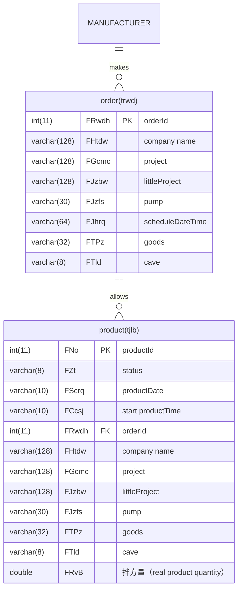
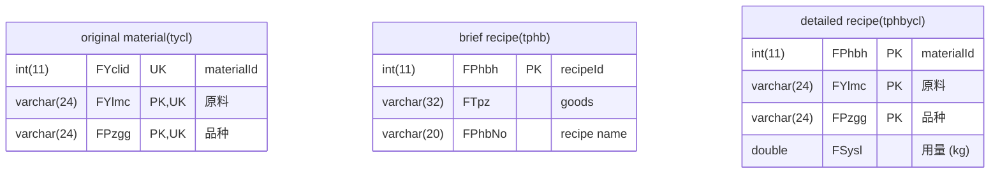
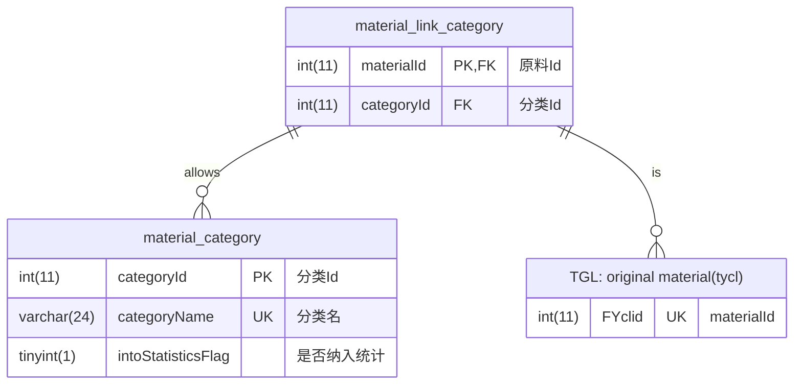

# SCG_TGL_assistant
Implement features that are not yet implemented by TGL

## TGL TABLE

We mainly obtain data for the TGL software from the following table:

### order list table (called: trwd)
  
| columnName | description                        | used |
| ---------- | ---------------------------------- | ---- |
| FRwdh      | orderId                            | Y    |
| FHtbh      | contractId                         |      |
| FRwxz      |                                    |      |
| FRwly      | from which software                |      |
| FZt        | status                             | Y    |
| FHtdw      | company name                       | Y    |
| FGcmc      | project name                       | Y    |
| FGcjb      |                                    |      |
| FGclb      |                                    |      |
| FJzbw      | littleProject name                 | Y    |
| FJzfs      | pump                               | Y    |
| FBclb      |                                    |      |
| FGcdz      | location                           |      |
| FGls       |                                    |      |
| FJhrq      | scheduleDateTime                   | Y    |
| FTPz       | goods                              | Y    |
| FTld       | cave                               | Y    |
| FSNbh      |                                    |      |
| FSzgg      |                                    |      |
| FTbj       |                                    |      |
| FJhsl      | schedule quantity                  |      |
| FScbt      |                                    |      |
| FWcsl      | finish quantity                    | Y    |
| FLjcs      | car amount                         | Y    |
| FXdrw      |                                    |      |
| FCzy       | operator name                      |      |
| FDlrq      |                                    |      |
| FSgpb      | schedule recipeId                  |      |
| FSjpb      |                                    |      |
| FJbsj      | schedule mixingTime                |      |
| FPhbNo     | schedule recipe name               |      |
| FBSfs      |                                    |      |
| Fwyzfs     | foreign aid from others quantity   | Y    |
| Fwyzcs     | foreign aid from others car amount | Y    |
| FVersion   | update this row DateTime(UTC)      |      |
| updateTime | update this row DateTime(UTC+8)    |      |

### product list table (called: tjlb)
  
| columnName | description                                           | used |
| ---------- | ----------------------------------------------------- | ---- |
| FNo        | productId                                             | Y    |
| Fguid      |                                                       |      |
| FZt        | status                                                | Y    |
| FScrq      | productDate                                           | Y    |
| FScbt      | machineId                                             | Y    |
| FDcsj      | 到场时间                                              |      |
| FCcsj      | start productTime                                     | Y    |
| FRwdh      | orderId                                               | Y    |
| FHtbh      | contractId                                            |      |
| FKhbh      |                                                       |      |
| FHtdw      | company name                                          | Y    |
| FGcmc      | project name                                          | Y    |
| FGcdz      | location                                              |      |
| FJzbw      | littleProject name                                    | Y    |
| FJzfs      | pump                                                  | Y    |
| FGls       |                                                       |      |
| FTPz       | goods                                                 | Y    |
| FTld       | cave                                                  | Y    |
| FSgpb      | original recipeId                                     |      |
| FSjpb      |                                                       |      |
| FShch      | license plate number                                  | Y    |
| FSjxm      | driver name                                           |      |
| FBcps      | mixing times amount                                   |      |
| FBcfs      | 本车方量 (in car quantity)                            |      |
| FZzl       | weight                                                |      |
| FBsfs      | 泵送方量                                              |      |
| FLjfs      | in car quantity cumulative total                      |      |
| FLjcs      | car cumulative total                                  |      |
| FCcqf      | 出场签发 (issuer name)                                |      |
| FYhqs      |                                                       |      |
| FCzy       | operator name                                         |      |
| FBz        |                                                       |      |
| FRz        |                                                       |      |
| FPhbNo     | original recipe name                                  |      |
| FBcfsC     | ? 不一定 FBcfsC + FBcfsM = FBcfs                      |      |
| FBcfsM     | ?                                                     |      |
| FPcbID     |                                                       |      |
| FPhbSJ     |                                                       |      |
| FRvA       | 余方量 (别的工地转过来的，车里剩的)(surplus quantity) | Y    |
| FRvB       | 拌方量 (real product quantity)                        | Y    |
| FRvC       | 票方量                                                |      |
| FQvA       | 退方量 (全都是0，未使用)                              |      |
| FCcsjEx    | end productTime                                       |      |
| Fdywc      | 小票是否打印完成 (has printed)                        |      |
| Fqrscwc    | 确认生产完成 (has produced)                           |      |
| Fdysj      | 第一次小票打印的时间 (printDateTime)                  |      |
| FVersion   | update this row DateTime(UTC)                         |      |
| updateTime | update this row DateTime(UTC+8)                       |      |

### original material table (called: tycl)
  
| columnName | description | used |
| ---------- | ----------- | ---- |
| FYclid     | materialId  | Y    |
| FYlmc      | 原料        | Y    |
| FPzgg      | 品种        | Y    |
| FLb        |             |      |

### brief recipe table (called: tphb)
  
| columnName | description                   | used |
| ---------- | ----------------------------- | ---- |
| FPhbh      | recipeId                      | Y    |
| FZt        | status                        |      |
| FTpz       | goods                         | Y    |
| FYt        | 用途                          |      |
| FTld       | cave                          | Y    |
| FSnpz      | 水泥品种                      |      |
| FSzgg      | 石子规格                      |      |
| FTbj       | 砼标记                        |      |
| FTlq       | 龄期                          |      |
| FBz        |                               |      |
| FSy        |                               |      |
| FSh        |                               |      |
| FJsfz      |                               |      |
| FCzy       | operator name                 |      |
| FDlrq      |                               |      |
| FJbsj      | 搅拌时间                      |      |
| FClsjNo    |                               |      |
| FPhbNo     | recipe name                   | Y    |
| FVersion   | update this row DateTime(UTC) |      |

### detailed recipe table (called: tphbycl)
  
| columnName | description                   | used |
| ---------- | ----------------------------- | ---- |
| FPhbh      | recipeId                      | Y    |
| FYlmc      | 原料                          | Y    |
| FPzgg      | 品种                          | Y    |
| FSysl      | 用量 (kg)                     | Y    |
| FVersion   | update this row DateTime(UTC) |      |

### original product recipe table (called: trwdphbycl)
  
| columnName | description                                   | used |
| ---------- | --------------------------------------------- | ---- |
| FId        | 自增Id                                        |      |
| FRwdh      | orderId                                       | Y    |
| FPblb      | 类别 (0是施工recipe, 1是砂浆recipe, 忽略砂浆) | Y    |
| FYlmc      | 原料                                          | Y    |
| FPzgg      | 品种                                          | Y    |
| FSysl      | 用量 (kg)                                     | Y    |
| FPlcw      |                                               |      |
| FBtId      | machineId                                     |      |
| FCkno      |                                               |      |
| FHsl       | 含水率                                        |      |
| updateTime | update this row DateTime(UTC+8)               |      |

### adjustable product recipe table (called: trwdphb)
  
| columnName | description    | used |
| ---------- | -------------- | ---- |
| FId        | 编号           | N    |
| FRwdh      | 任务单号       | N    |
| FTzsj      | 调整时间       | C    |
| FPblx      | 类别           | C    |
| FPbh1      | 调整前配比编号 | N    |
| FPbh2      | 调整后配比编号 | N    |
| FXpbh      |                | N    | (无注释) |
| FLjcs      | 累计车数       | N    |
| FCzy       | 操作员         | C    |
| FSyy       | 试验员         | C    |
| FBz        | 备注           | C    |
| FNo        |                | N    | (无注释) |
| updateTime | 更新时间       | C    |

## TGL ERD

键可以是 PK、FK 或 UK，分别表示主键、外键或唯一键。主键 一定是 唯一键

## STA TABLE

### material category table (called: material_category)

| columnName         | description  |
| ------------------ | ------------ |
| categoryId         | PK           |
| categoryName       | UK,分类名    |
| intoStatisticsFlag | 是否纳入统计 |

### material link category table (called: material_link_category)

| columnName | description |
| ---------- | ----------- |
| materialId | PK,FK       |
| categoryId | FK,可重复   |

## STA ERD

